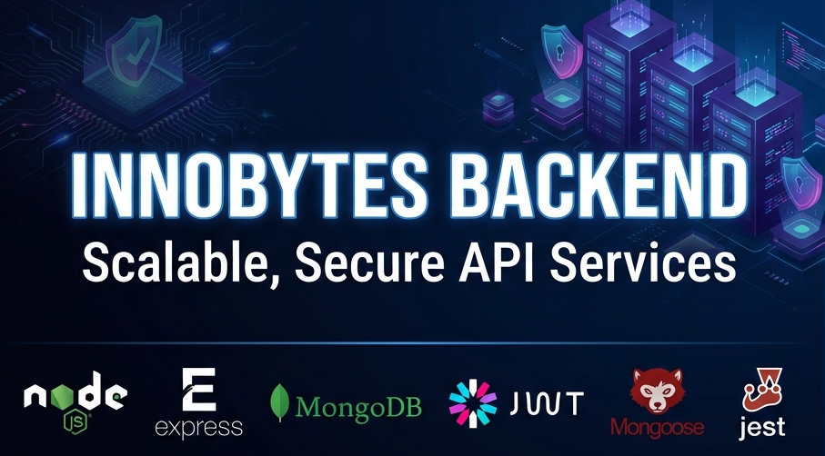

# Innobytes Backend API



> A robust, secure, and scalable RESTful API built with Node.js, Express, and MongoDB.


## 📋 Table of Contents

- [Project Overview](#-project-overview)
- [Key Features](#-key-features)
- [Tech Stack](#-tech-stack)
- [Getting Started](#-getting-started)
  - [Prerequisites](#prerequisites)
  - [Installation](#installation)
  - [Environment Variables](#environment-variables)
- [API Documentation](#-api-documentation)
  - [Authentication](#authentication)
  - [Posts](#posts)
  - [Comments](#comments)
- [Testing](#-testing)
- [Project Structure](#-project-structure)

## 🚀 Project Overview

The **Innobytes Backend** is a fully functional Blog API designed to handle user authentication, content management (posts), and user engagement (comments). It features secure JWT-based authentication, robust input validation, and a clean, layered architecture separating controllers, services, and data access.

## ✨ Key Features

- **🔐 Secure Authentication**: User registration and login using JWT (JSON Web Tokens) and bcrypt for password hashing.
- **📝 Post Management**: Create, read, update, and delete blog posts.
- **💬 Comment System**: Users can comment on posts to engage with content.
- **🛡️ Data Validation**: Comprehensive request validation using `express-validator` to ensure data integrity.
- **🔒 Route Protection**: Middleware to protect sensitive routes and ensure only authorized users can perform actions.
- **🧪 Automated Testing**: Full suite of Unit and Integration tests using Jest and Supertest.
- **❌ Error Handling**: Centralized error handling mechanism for consistent API responses.

## 🛠 Tech Stack

- **Runtime**: [Node.js](https://nodejs.org/)
- **Framework**: [Express.js](https://expressjs.com/)
- **Database**: [MongoDB](https://www.mongodb.com/) (via [Mongoose](https://mongoosejs.com/))
- **Authentication**: [jsonwebtoken](https://github.com/auth0/node-jsonwebtoken), [bcryptjs](https://github.com/dcodeIO/bcrypt.js)
- **Validation**: [express-validator](https://express-validator.github.io/)
- **Testing**: [Jest](https://jestjs.io/), [Supertest](https://github.com/ladjs/supertest), [Mongodb-Memory-Server](https://github.com/nodkz/mongodb-memory-server)

## 🏁 Getting Started

Follow these steps to set up the project locally.

### Prerequisites

- **Node.js** (v16 or higher)
- **npm** or **yarn**
- **MongoDB** (Local instance or Atlas URI)

### Installation

1.  **Clone the repository**

    ```bash
    git clone https://github.com/yourusername/innobytes-backend.git
    cd innobytes-backend
    ```

2.  **Install dependencies**

    ```bash
    npm install
    ```

3.  **Configure Environment**
    Create a `.env` file in the root directory and add the following variables:

    ```env
    PORT=5000
    MONGO_URL=mongodb://localhost:27017/innobytes_db
    JWT_SECRET=your_super_secret_jwt_key
    NODE_ENV=development
    ```

4.  **Start the Server**

    ```bash
    # Development mode (with nodemon)
    npm run dev

    # Production mode
    npm start
    ```

## 📡 API Documentation

Base URL: `http://localhost:5000/api`

### Authentication

| Method | Endpoint          | Description              | Auth Required |
| :----- | :---------------- | :----------------------- | :------------ |
| `POST` | `/users/register` | Register a new user      | ❌            |
| `POST` | `/users/login`    | Login and receive JWT    | ❌            |
| `GET`  | `/users/profile`  | Get current user profile | ✅            |

**Example Register Body:**

```json
{
  "username": "johndoe",
  "email": "john@example.com",
  "password": "securepassword123"
}
```

### Posts

| Method   | Endpoint     | Description             | Auth Required |
| :------- | :----------- | :---------------------- | :------------ |
| `GET`    | `/posts`     | Get all posts           | ❌            |
| `POST`   | `/posts`     | Create a new post       | ✅            |
| `GET`    | `/posts/:id` | Get a single post by ID | ✅            |
| `PUT`    | `/posts/:id` | Update a post           | ✅            |
| `DELETE` | `/posts/:id` | Delete a post           | ✅            |

**Example Create Post Body:**

```json
{
  "title": "The Future of AI",
  "content": "Artificial Intelligence is rapidly evolving..."
}
```

### Comments

| Method   | Endpoint        | Description                       | Auth Required |
| :------- | :-------------- | :-------------------------------- | :------------ |
| `GET`    | `/comments`     | Get comments (use `?post_id=...`) | ❌            |
| `POST`   | `/comments`     | Add a comment to a post           | ✅            |
| `GET`    | `/comments/:id` | Get a single comment              | ✅            |
| `PUT`    | `/comments/:id` | Update a comment                  | ✅            |
| `DELETE` | `/comments/:id` | Delete a comment                  | ✅            |

**Example Create Comment Body:**

```json
{
  "post_id": "64f8a...",
  "content": "Great article! Thanks for sharing."
}
```

## 🧪 Testing

This project uses **Jest** and **Supertest** for automated testing.

Run all tests:

```bash
npm test
```

Run tests in watch mode:

```bash
npm test -- --watch
```

## 📂 Project Structure

```
Innobytes/Backend/
├── assets/             # Project assets (images, etc.)
├── config/             # Database configuration
├── controllers/        # Request handlers (logic)
├── middleware/         # Custom middleware (Auth, Error, Validation)
├── Models/             # Mongoose models (Schema)
├── routes/             # API Route definitions
├── tests/              # Unit and Integration tests
│   ├── integration/    # API endpoint tests
│   └── unit/           # Controller unit tests
├── validators/         # Input validation rules
├── .env                # Environment variables
├── server.js           # Entry point
└── package.json        # Dependencies and scripts
```

---

Made with ❤️ by Malay Maity.
